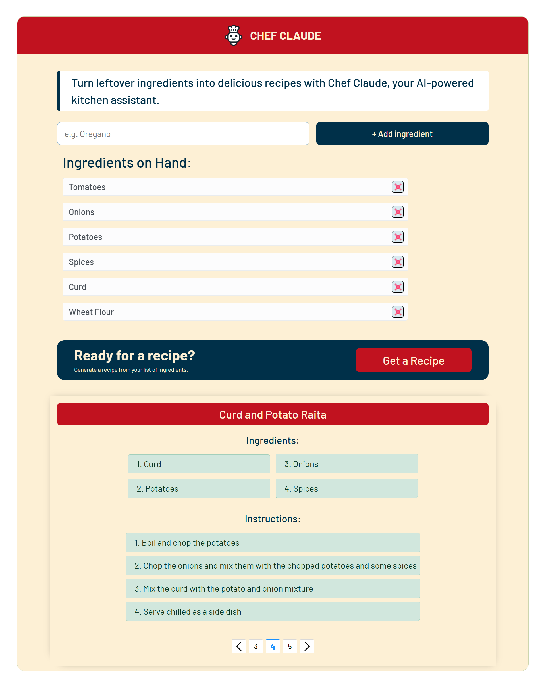
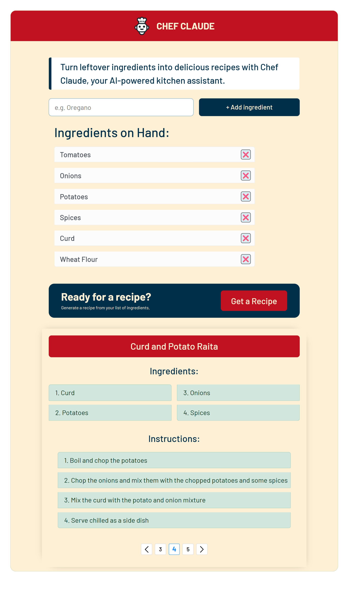
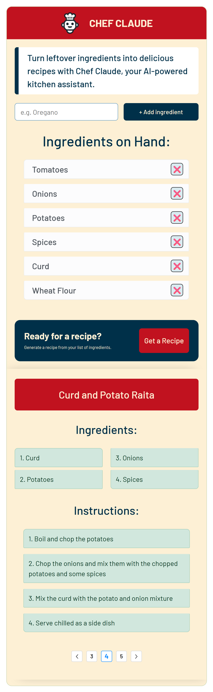
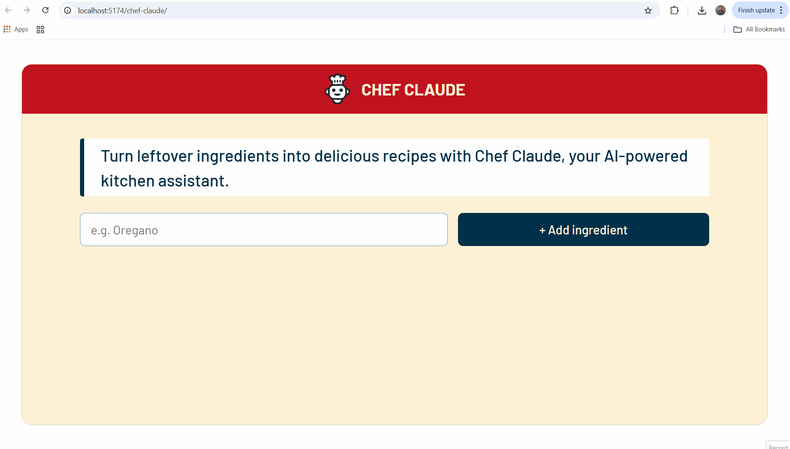
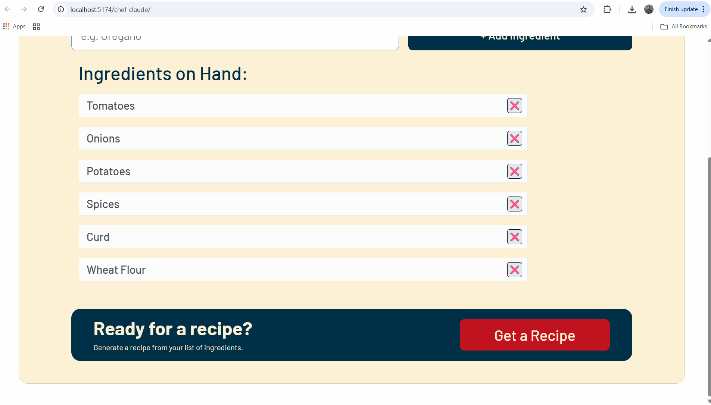

# 👨‍🍳 Chef Claude – AI Recipe Generator

Turn leftover ingredients into delicious meals with **Chef Claude**, your AI-powered kitchen assistant.  
Enter the ingredients you have, and let the app generate creative recipes with clear instructions.

---

## ✨ Features

- 📝 **Ingredient Management**

  - Add and remove ingredients dynamically
  - Duplicate detection and error messages (e.g., "Already Added", "Nothing to add")

- 🤖 **AI Recipe Generation**

  - Powered by **Groq (LLaMA 3.3)** and **Mistral Mixtral**
  - Returns **multiple recipe suggestions** with ingredients and step-by-step instructions
  - Handles JSON parsing gracefully with fallback to raw text

- 🎨 **Modern Responsive UI**

  - Flash messages: text slides in from the **right** and exits to the **left**, with new messages cycling automatically
  - Buttons with **interactive hover effects**:
    - Sliding color animation
    - Smooth scaling effect
  - Animated ingredient list with transitions when adding/removing items
  - Works beautifully on **desktop, tablet, and mobile**

- 📖 **Recipe Display**
  - Clean two-column ingredient grid
  - Step-by-step instructions with styled list
  - Custom pagination to browse multiple recipes

---

## 🛠️ Tech Stack

- **Frontend:** React 19, TypeScript, Vite
- **Styling:** CSS Modules + custom animations
- **State Management:** React Hooks (`useState`, `useEffect`, `useRef`)
- **APIs:**
  - Groq (LLaMA 3.3-70B) for recipe generation
  - Hugging Face (Mistral Mixtral-8x7B-Instruct) as fallback
- **Animations & Transitions:** React Transition Group + custom CSS

---

## 🚀 Getting Started

1. Clone the repository:

```bash
git clone https://github.com/akshitjain3/chef-claude.git
cd chef-claude
```

2. Install dependencies:

```bash
npm install
```

3. Create a `.env` file with your API keys:

```env
VITE_GROQ_API_KEY=your_groq_api_key
VITE_HF_API_KEY=your_huggingface_api_key
```

4. Start the development server:

```bash
npm run dev
```

5. Open [http://localhost:5173](http://localhost:5173) in your browser.

---

## 📸 Screenshots & Demo

### Desktop View

  
_Ingredients list and recipe generation view._

### Tablet View

  
_Responsive layout optimized for medium screens._

### Mobile View

  
_Compact layout for small screens with all functionality intact._

### Flash Messages


Text enters from the right, stays visible, and smoothly slides out to the left.

### Ingredient Management


### Recipe Generation



---

## 🌐 Live Demo

👉 [Hosted App Link](https://akshitjain3.github.io/chef-claude)

---

## 🔮 Future Improvements

- Save user’s last session locally
- Option to adjust serving size
- Favorites tab for saved recipes
- Dark/light theme toggle

---

## 📚 Learning Outcomes

This project helped practice:

- AI integration with **Groq & Hugging Face APIs**
- Responsive UI with **CSS animations and transitions**
- Error handling and graceful fallbacks
- Pagination and smooth scroll-to-content UX

---

## 📝 License

This project is for **learning and demonstration purposes**.
